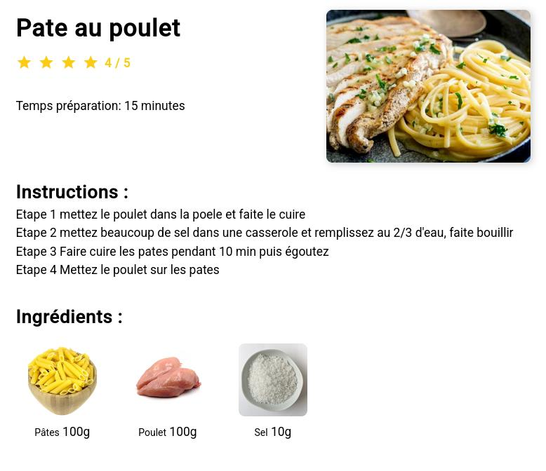
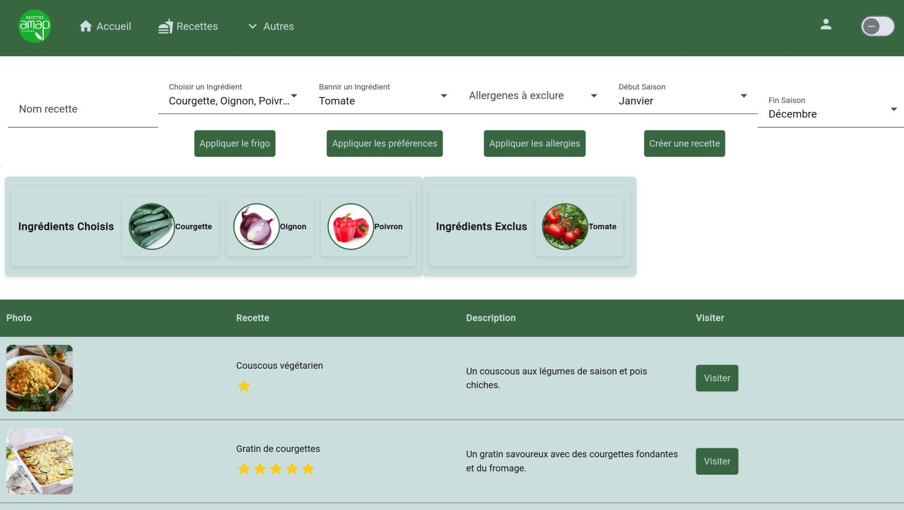
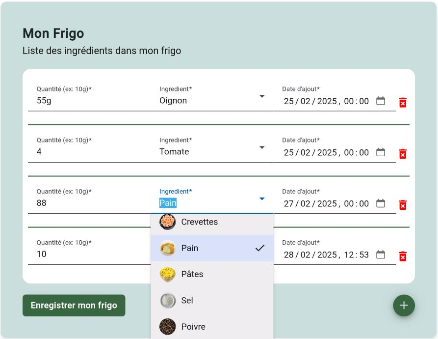

# Projet Tutoré recette amap

Une Association pour le Maintien de l’Agriculture Paysanne (AMAP)
est une forme de partenariat de proximité entre un groupe de 
consommateurs et un ou plusieurs producteurs. Les consommateurs 
s’engagent à acheter à l’avance une partie de la production, 
généralement sous forme de paniers de légumes, fruits ou autres produits
de la ferme, distribués régulièrement. 

Chaque semaine apporte son lot de surprises et, parfois, de défis
culinaires. Face à une variété de légumes, certains très familiers et 
d’autres moins courants, la question se pose souvent : «Que vais-je bien pouvoir cuisiner avec ces ingrédients cette semaine ».

C'est la qu'intervient ce site de partage de recette,
il est pensé pour facilement partager des recettes 
et en chercher.

La distinction avec les autres site de recettes se fait surtout
avec **la fonctionnalité de recherche, qui permet de renseigner des ingrédients dont on dispose, 
et le site propose les recettes contenent le plus de ces ingrédient**, afin de pouvoir les utilisers ensemble.  
Une autre particularité du site est qu'il dispose d'une fonction ou les
producteurs peuvent renseigner les ingrédients des paniers qu'ils distribuent au Amapiens, ainsi
que la date à laquel il est disribué, les ingrédients aparaitront ensuite dans le
"frigo" de l'utilisateur sur le site.  
Le frigo est l'endroit ou l'utilisateur peut renseigner les ingrédients qu'il possède
chez lui, les contenus des paniers s'ajoute automatiquement dans le frigo.
L'utilisateur peut ensuite, en un seul clic, appliquer les ingrédients du frigo à la recherche.  
La recherche possède aussi un filtre d'exclusion d'ingrédient 
et un filtre d'allergies, qui exclue les recettes ayant des ingrédients contenant ces allérgènes.  

## Contexte
Ce site à été fait lors d'un projet tutoré étalé sur 4 périodes de 1 semaines au cours de l'année.
Beaucoup de décisions ont été faites avec un grand manque d'éxpérience et regrétée plus tard.  
Voici d'autres fonctionnalitées qui était prévues mais qui n'on pas été ajouté par manque de temps.
- Ajout d'ingrédient par les utilisateurs
- Gestion des allérgies de l'utilisateurs, des ustensiles requis pour une recette et ceux requis par l'utilisateur
- Gestion de tags (végé, libanais, dessert...)
- Possibilité de noter les recettes
- Outils de modération

## Démo





Deux vidéo tutoriel sur le projet, la première pour les utilisateurs normaux, la deuxième pour les producteurs.  
https://www.youtube.com/watch?v=k3eGtsyB86k
https://www.youtube.com/watch?v=CgufWsx-VAY

<!-- <iframe width="560" height="315" src="https://www.youtube-nocookie.com/embed/k3eGtsyB86k?si=RcTEdBr6NDhs6QOu" title="YouTube video player" frameborder="0" allow="accelerometer; autoplay; clipboard-write; encrypted-media; gyroscope; picture-in-picture; web-share" referrerpolicy="strict-origin-when-cross-origin" allowfullscreen></iframe>
<!-- <https://www.youtube.com/watch?v=CgufWsx-VAY> 
<iframe width="560" height="315" src="https://www.youtube.com/embed/CgufWsx-VAY?si=vQB4qV_IU8GHHr1g" title="YouTube video player" frameborder="0" allow="accelerometer; autoplay; clipboard-write; encrypted-media; gyroscope; picture-in-picture; web-share" referrerpolicy="strict-origin-when-cross-origin" allowfullscreen></iframe>
-->

## Groupe
DAZA       Sasha  
PEROT      Mathis  
PINOT      Gaëtan  
PRYKHODKO  Yehor  

<!-- ## Logins -->
<!---->
<!-- client     -- alice   1234 -->
<!-- producteur -- charlie 1234 -->
<!---->
<!-- <!-- # Liens: --> -->
<!-- <!-- ## Docketu: --> -->
<!-- <!-- Api: <http://docketu.iutnc.univ-lorraine.fr:12200> --> -->
<!-- <!-- Adminer: <http://docketu.iutnc.univ-lorraine.fr:12201> --> -->
<!---->
<!-- ## TODO PRES: -->
<!-- - [x] Démo -->
<!-- - [x] Présentation orale -->
<!-- - [ ] Vidéo de présentation -->
<!--     - [ ] Tuto utilisateur -->
<!--     - [ ] Tuto producteur -->
<!--     - [ ] Vidéo techniques -->
<!-- - [ ] CMS gestion (gantt+heure-homme) -->
<!--     - [x] Conclusion du projet -->


## Docu technique
Ce site web est fait pour être déployé sur un serveur
linux.
### Config
Les fichiers d'environnement sont des fichiers
qui contienne des informations qui doivent être 
changé en fonction de l'environnement dans lequel
l'appliquation tourne.  

Les fichiers terminant par `.dist` sont des fichiers 
d'exemple qu'il faut copier en enlevant le .dist
pour deployer l'application.
`.env` Contient les ports des service  

`db.env` Contient les informations que la base de donnée
utilise pour les mots de passe et les utilisateurs
**ATTENTION** ces informations permette aussi d'acceder
à la base de donnée avec Adminer, il faut donc faire attention
à ne pas les divulguer, sinon la base de donnée risque d'être
attaqué.  

Le fichier `./api/config/db.ini` contient les informations
utilisé par l'API pour se connecter a la base de donnée 
ils doivent être cohérent avec ce qui est dans `db.env`  

Le fichier `secret.env` contient le secret utilisé
par le token JWT  

`./Front/src/environment.ts` contient l'adresse de l'API
utilisé par le Front end pour se connecter a l'API,
c'est l'url de l'endroit ou votre serveur API est déployé

### Docker
L'application utilise des conteneurs docker pour
deployer l'application.
Une fois que les fichiers de configuration sont copiés
on peut passer au lancement des conteneurs.
On commence par installer les dépendances php avec 
la commande 
`docker compose run php sh -c "composer install && composer upgrade"`  
Puis on lance les conteneurs avec la commande 
`docker compose up -d --remove-orphans;`  
Une fois les containeurs lancés, si la base de donnée 
n'est pas initialisé, on peut le faire avec la commande
`docker compose exec amap.db bash -c "psql -U user amap < /var/sql/dump_2802.sql"`  
Cela inserera les tables ainsi que les données de base de
l'application.  
Normalement à ce moment là l'appplication est fonctionnelle

## Maintenance
Pour maintenir l'application il vous faut des conaissances 
techniques differentes en fonction de ce que vous voulez 
modifier.  
Je ne rentrerais pas dans les détails du fonctionnement
de l'application, mais je vais donner les grandes lignes.  
Le site fonctionne avec un front-end en angular et une api
en php, qui se connecte à une base de donnée postgresql.
L'application front-end fait des requetes http à l'api 
qui fait des requetes sql à la base de donnée
pour récupéré les données afin de les afficher.

### Front end
Le front end est fait avec angular, il est dans le dossier
`./Front`  
Si vous changez quelque chose dans le front end, il faut
relancer le conteneur front-build avec la commande
`docker compose up front-build`  
Cela aura pour effet de rebuild l'application, qui est
servie statiquement par un serveur nginx dans le 
containeur front-web  

Chaque composant
est divisé en 3 fichiers, un fichier html pour le contenu
un fichier css pour le style et un fichier ts pour le 
comportement.  

Si vous voulez modifier certaines parties du texte affichés,
comme les titres des menus ou les textes des boutons, vous
devez aller modifier les fichiers html.

Je vous conseille d'utiliser un outil de recherche
textuel sur plusieurs fichier pour trouver ce que vous
cherchez.  

Si vous voulez changer les couleurs de l'application,
les couleurs principales sont dans le fichier styles.scss
Structure de fichier:

Si vous voulez rajouter des nouveaux composant il faut le faire
au travers de l'outil en ligne de commande, il modifierat des 
fichiers de configuration tout seul et c'est très pratique 
```
└── Front
    ├── public //contient les differents assets static qui ne change pas, comme les logos
    └── src // contient le code source de l'application
        └── app
            ├── Components //Contient les components de l'application
            ├── Guard //Contient les guards 
            ├── Interfaces //contient la structure des objet typé custom typescript, utile pour les objet de l'api
            ├── router //Config des routes,
            └── Services //service d'appel a l'api en fonction du sujet appelé
                └── store //store d'auth pour conserver le token d'auth
```

#### Liens docs:  
[Angular](https://angular.dev)
[Composant](https://angular.dev/essentials/components)  
[Objet typé custom typescript](https://www.typescriptlang.org/docs/handbook/2/objects.htm)  
[Guards](https://angular.dev/guide/routing/common-router-tasks#preventing-unauthorized-access)  
[CLI](https://angular.dev/tools/cli)

### Back end
Le back end est dans le fichier `./api`
il est fait en php avec la librairie [slim](https://www.slimframework.com/) pour le routing
et [doctrine](https://www.doctrine-project.org/)
pour l'accès base de donnée.  
Vous n'avez pas besoin de recompiler le back end.  
Pour la configuration tout est dans le dossier config, il contient
le bootstrap et les déclaration de dépendence pour l'injection de 
dépendances [Injection de dependence](https://php-di.org/doc/) 
Il est important de noter que l'application suit (du mieux qu'elle peut)
le principe d'[architecture hexagonal](https://fr.wikipedia.org/wiki/Architecture_hexagonale)
, ce qui veut dire que les differentes parties de l'application sont isolée.  

Donc le cotée applicatif, c'est là ou on reçoit la requette http et ou on renvoit le json.  
Le metier (core) c'est là ou reside la logique de l'application (très peu dans notre cas).  
L'infrastructure c'est l'accès au services exterieurs, ici simplement la base de donnée.  

```
├── api
│   ├── config //fichiers de configuration (bootstrap, routes, dependances)
│   ├── src // fichier source
│   │   ├── application //face publique de l'application
│   │   │   └── action //les actions se charge de traiter la requette, et de retourner les bonnes données
│   │   ├── core
│   │   │   ├── dto //format des données entre l'application et le core
│   │   │   ├── entities //format des données dans la base de donnée
│   │   │   └── service //la ou la logique de l'application est
│   │   ├── infrastructure //l'accès a la base de donnée
│   │   │   ├── entities
│   │   │   └── repository //chaque classe s'occupe d'une differente partie de la BD
│   │   └── middleware //middleware pour l'authentification et l'authorization d'accès au ressources
```

### Base de donnée
Le site ne possède pas de systeme d'administration, 
si vous voulez enlever des recettes, il faudrat le faire 
directement sur la base de donnée.  
Pour ça il y a un site adminer dans le conteneur.
Il vous permet de se connecter à la base de donnée 
**ATTENTION** il n'y a pas de système de backup, si vous
supprimez des données, elles sont perdues.  
Pour vous connecter à la base de donnée, il vous faut
entré les infos suivantes:
- System: PostgreSQL
- Server: amap.db (c'est le nom du service dans le docker-compose)
- Username: le nom d'utilisateur du fichier `db.env`
- Password: le mot de passe du fichier `db.env`
- Database: la database du fichier `db.env`
Il est conseillé d'avoir des conaissances en SQL pour 
modifier la base de donnée. Cependant il est possible
de modifier directement les table avec les outils d'adminer 
sans ecrire de requête sql.  

<!-- # Vidéo -->
<!-- ## Tuto utilisateur -->
<!-- - Presentation rapide de la problématique auxquel répond -->
<!-- le site -->
<!-- Bonjour, bienvenue dans ce tutoriel pour apprendre à utiliser le site Recettes Amap, -->
<!-- un site qui vous permet de trouver facilement des recettes pour utiliser les ingredients -->
<!-- de vos paniers. -->
<!-- Cela se fait en étapes, vous trouvez le producteur qui fournit votre panier, vous vous abonner  -->
<!-- à lui sur le site, et lors ce qu'il publie un panier, les ingredients qu'il a renseigné dedans -->
<!-- se retrouve dans votre frigo virtuel, vous pouvez ensuite facilement selectionner les ingredients -->
<!-- de votre frigo pour faire une recherche de recette. -->
<!---->
<!-- Je vais vous montrer comment utiliser les fonctionnalitées du site -->
<!-- En premier il faut se connecter -->
<!-- - Inscription/Connexion -->
<!-- - Abonnement à des producteurs -->
<!-- - Gestion du profile (desabonner producteur et changer allergnes) -->
<!-- - Gestion du frigo -->
<!-- - Recherche de recette -->
<!-- - Ajout de recette -->
<!-- ## Tuto producteur -->
<!-- - Inscription/Connexion -->
<!-- - Création de panier -->
<!-- - Publication de panier -->
<!-- - Gestion des ingredients produits -->
